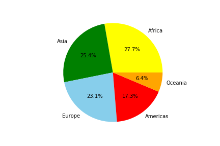
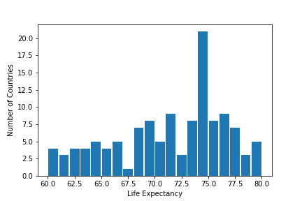
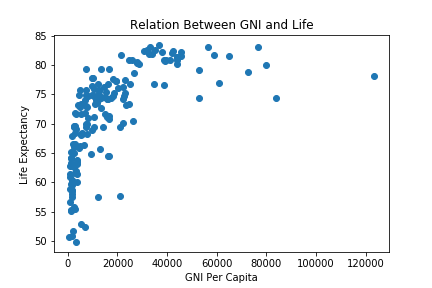
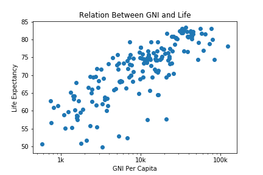
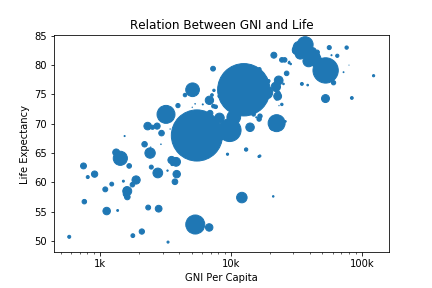
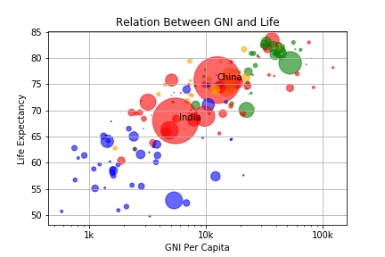

## Human Development Report(2015) Visualization

### Jiajun Chen
 
- 
 Summary measure of achievements in key dimensions of human development.

- 
 GNI per Capita, Mean Education Year, Life Expectency, etc.

- 
 HDI index indicate the development of a country in a comprehensive sense.

- 
 [Human Development Report 2015 Data.](https://www.kaggle.com/undp/human-development)

 
 
 
 
 
 

---

**Basic Data Visualization**

---

**Data Relation Analysis**

---

**Relation between GIN and Life Expectancy**

--

**Relation between GIN and Life Expectancy**

--

**Scaled by population**

--

**Colored by continent**

---

**Relation between Education and Life Expectancy**

---

# HDI

- Human Development Index
- Proposed by United Nations Development Programme
- An index assessing the development of a country
- Calculated based on GNI, Life Expectancy， Gender Inequalities, etc.

--

**HDI of 2015**
- [Map](./images/HDI_Map.html)

--

**HDI over years**
- [Multiline](./images/HDI_Multiline.html)
- [Race Bar Char]()

---

## Thank you
 
 
 
 
 
 
